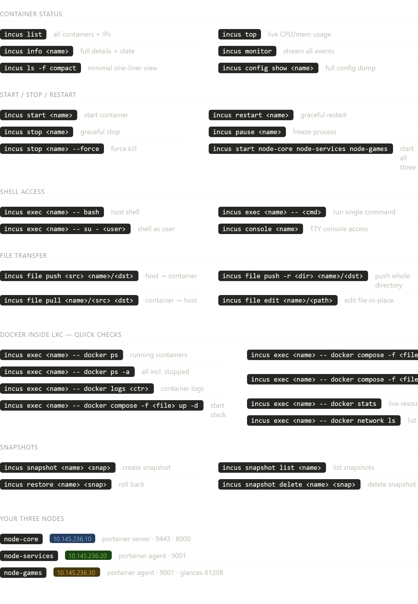

# Infrastructure for my Homelab

## Storage

| Storage Type | Host path          | What goes here                                 |
|:------------:|:-------------------|------------------------------------------------|
|   SSD (OS)   | `/opt/appdata`     | Databases, certificates, hompage configs, etc. |
|     HDD      | `/mnt/storage-hdd` | Media, Backups, game server assets (MC worlds  |

## Incus cheat sheet
