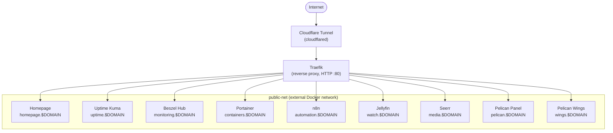

# Homelab Infrastructure

A Docker Compose-based homelab split into independent, purpose-built stacks. All stacks connect through a shared `public-net` Docker network and are exposed via a centralised Traefik reverse proxy with a Cloudflare Tunnel for external access.

---

## Architecture Overview



> `$DOMAIN` refers to the `DOMAIN` variable configured per stack — see each stack's Configuration Variables table.

---

## Stacks

| Stack | Services | README |
|-------|----------|--------|
| [`ingress`](stacks/ingress/) | Traefik, Cloudflared, docker-socket-proxy | [→](stacks/ingress/README.md) |
| [`base`](stacks/base/) | Portainer, Beszel agent | [→](stacks/base/README.md) |
| [`monitoring`](stacks/monitoring/) | Homepage, Uptime Kuma, Watchtower, Beszel hub, docker-socket-proxy | [→](stacks/monitoring/README.md) |
| [`medialab`](stacks/medialab/) | Jellyfin, Seerr, Prowlarr, Radarr, Sonarr, Bazarr, SABnzbd | [→](stacks/medialab/README.md) |
| [`automation`](stacks/automation/) | n8n, Ollama, docker-socket-proxy | [→](stacks/automation/README.md) |
| [`pelican`](stacks/pelican/) | Pelican panel + wings, MariaDB, Redis | [→](stacks/pelican/README.md) |

---

## Network Topology

| Network | Type | Purpose |
|---------|------|---------|
| `public-net` | External (shared) | Cross-stack connectivity; Traefik discovers containers here |
| `ingress-net` | Internal bridge | Traefik ↔ docker-socket-proxy (isolated) |
| `base-net` | Bridge | Portainer internal services |
| `monitoring-net` | Bridge | Monitoring-stack internal services |
| `media-net` | Bridge | Media-stack internal services |
| `automation-net` | Bridge | Automation-stack internal services |
| `pelican-net` | Bridge | Pelican-stack internal services |

> **Note:** `public-net` must be created before starting any stack:
> ```bash
> docker network create public-net
> ```

---

## Port Allocation

| Range | Purpose | Access |
|-------|---------|--------|
| `80` | Traefik HTTP entrypoint | Public, via Cloudflare Tunnel |
| `81` | Traefik dashboard | Host only — restrict further in production |
| `10000–10050` | Reserved for internal/private services (operational back-ends with no built-in auth) | Intended to be Tailscale-only — see note below |

Services in the `10000–10050` range are back-office tools (e.g. Prowlarr, Radarr, Sonarr, Bazarr, SABnzbd in the `medialab` stack — see [`stacks/medialab/README.md`](stacks/medialab/README.md)) that must never be reachable from the public internet. This range is reserved so any future private service has a predictable, non-conflicting port to bind to.

> **Current state:** these ports are bound to all host interfaces today, restricted only by convention (not yet enforced). The intended end state is to expose this range only over [Tailscale](https://tailscale.com) (e.g. binding to the host's Tailscale interface IP, or gating with Tailscale ACLs/serve), so the services are reachable from the tailnet only and never from the LAN or internet. This restriction is a known gap — see [Deferred Recommendations](#deferred-recommendations) below.

---

## Deferred Recommendations

The infrastructure audit in [RECOMMENDATIONS.md](RECOMMENDATIONS.md) identified two items that are intentionally **not** being implemented right now:

| Item | Recommendation | Why deferred |
|------|-----------------|---------------|
| Secrets Manager | [REC-02](RECOMMENDATIONS.md#rec-02-implement-a-secrets-manager) | Secrets stay in gitignored `.env` files on disk for now. Revisit if the host becomes shared/multi-tenant or compliance requirements change. |
| Private-service port restriction (Tailscale-only `10000–10050`) | [REC-07](RECOMMENDATIONS.md#rec-07-restrict-internal-only-services--remove-direct-host-port-exposure) | The port range is reserved and documented above, but the actual Tailscale/firewall enforcement is not yet in place. |

All other recommendations are tracked as issues in the GitHub repository.

---

## Storage Layout

| Type | Host Path | Purpose |
|------|-----------|---------|
| SSD (OS) | `/opt/appdata` | App config, databases, certificates |
| HDD | `/mnt/storage-hdd` | Media, backups, game server assets |

Each stack uses:
- `PATH_APPDATA` → `/opt/appdata/<stack-name>`
- `PATH_STORAGE` → `/mnt/storage-hdd/<stack-name>`
- `PATH_LOGS` → `/var/log/<stack-name>` (where applicable)

---

## Quick Start

### Prerequisites

- Docker + Docker Compose v2
- `make` (standard on Linux/macOS)
- A domain managed through Cloudflare

### 1. Create the shared network

```bash
docker network create public-net
```

### 2. Set up environment files

Copy the example env file for each stack you want to deploy and fill in the values:

```bash
make setup
```

Or manually:

```bash
cp stacks/.env.example stacks/ingress/.env
# edit stacks/ingress/.env
```

### 3. Deploy stacks (recommended order)

```bash
make up STACK=ingress
make up STACK=base
make up STACK=monitoring
make up STACK=medialab
make up STACK=automation
make up STACK=pelican
```

### Useful commands

```bash
make up    STACK=<name>   # Start a stack
make down  STACK=<name>   # Stop a stack
make logs  STACK=<name>   # Follow logs
make pull  STACK=<name>   # Pull latest images for a stack
make pull                  # Pull latest images for ALL stacks
```
