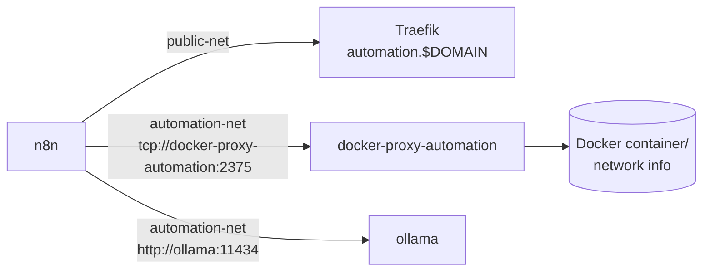

# Stack: automation

Workflow automation and local AI inference.

## Services

| Service | Image | Purpose |
|---------|-------|---------|
| `n8n` | `n8nio/n8n:latest` | Visual workflow automation platform with 400+ integrations |
| `ollama` | `ollama/ollama:latest` | Local LLM inference server (run models without cloud APIs) |
| `docker-proxy-automation` | `tecnativa/docker-socket-proxy` | Read-only Docker API proxy so n8n can inspect containers safely |

### Interactions



n8n logs are written to `/home/node/logs/n8n.log` inside the container (mapped to `PATH_LOGS/n8n`). Ollama model data is persisted in `PATH_APPDATA/ollama`.

## Prerequisites

- `public-net` must exist: `docker network create public-net`
- Sufficient RAM: n8n is capped at 1.5 GB, Ollama at 3.5 GB — ensure at least 6 GB free
- If running GPU-accelerated Ollama, add the appropriate `deploy.resources.reservations.devices` block

## Setup

```bash
cp stacks/.env.example stacks/automation/.env
# Fill in the required variables (see below)
docker compose -f stacks/automation/compose.yaml --env-file stacks/automation/.env up -d
```

Or with the root Makefile:

```bash
make up STACK=automation
```

## Configuration Variables

See [`.env.automation.example`](.env.automation.example) for a ready-to-copy template.

| Variable | Description | Example |
|----------|-------------|---------|
| `STACK_NAME` | Compose project name | `automation` |
| `PATH_APPDATA` | App data directory | `/opt/appdata/automation` |
| `PATH_LOGS` | Log directory | `/var/log/automation` |
| `TZ` | Timezone | `Europe/Zurich` |
| `DOMAIN` | Primary domain | `example.com` |
