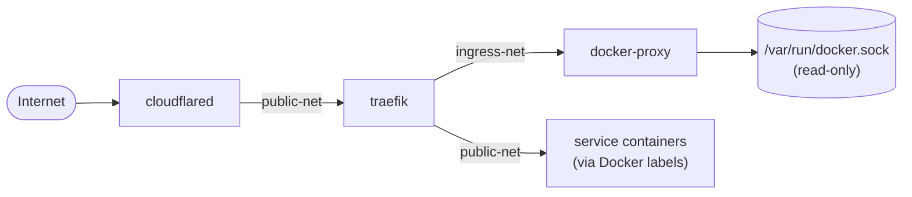

# Stack: ingress

Handles all inbound traffic routing and external connectivity.

## Services

| Service | Image | Purpose |
|---------|-------|---------|
| `traefik` | `traefik:latest` | Reverse proxy — routes HTTP traffic to services on `public-net` via Docker labels |
| `docker-proxy` | `tecnativa/docker-socket-proxy` | Read-only Docker API proxy — Traefik discovers containers without direct socket access |
| `cloudflare` | `cloudflare/cloudflared:latest` | Cloudflare Tunnel — exposes the homelab externally without opening firewall ports |

### Interactions



Traefik reads container labels from `public-net` through the socket proxy (`tcp://docker-proxy:2375`). Dynamic configuration (middlewares, TLS, etc.) can be placed in `$PATH_APPDATA/traefik/dynamic/`.

## Prerequisites

- Docker network `public-net` must exist: `docker network create public-net`
- A Cloudflare Tunnel token (generated in the Cloudflare Zero Trust dashboard)
- Domain managed in Cloudflare

## Setup

```bash
cp stacks/.env.example stacks/ingress/.env
# Fill in the required variables (see below)
docker compose -f stacks/ingress/compose.yaml --env-file stacks/ingress/.env up -d
```

Or with the root Makefile:

```bash
make up STACK=ingress
```

## Configuration Variables

See [`.env.ingress.example`](.env.ingress.example) for a ready-to-copy template.

| Variable | Description | Example |
|----------|-------------|---------|
| `STACK_NAME` | Compose project name | `ingress` |
| `PATH_APPDATA` | Traefik config directory | `/opt/appdata/ingress` |
| `TZ` | Timezone | `Europe/Zurich` |
| `DOMAIN` | Primary domain | `example.com` |
| `CF_TUNNEL_TOKEN` | Cloudflare Tunnel token | *(secret — never commit)* |

## Exposed Ports

| Port | Service | Purpose |
|------|---------|---------|
| `80` | Traefik | HTTP entrypoint |
| `81` | Traefik | Dashboard (insecure — restrict access in production) |
