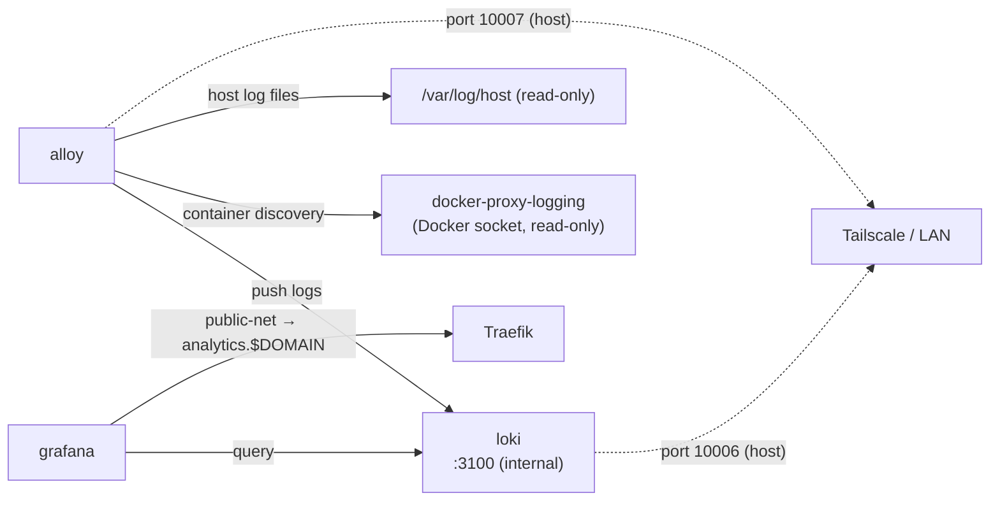

# Stack: logging

Centralised log aggregation using Grafana Loki + Alloy + Grafana.

## Services

| Service | Image | Purpose |
|---------|-------|---------|
| `loki` | `grafana/loki:3` | Log aggregation and storage backend (256 MB limit) |
| `alloy` | `grafana/alloy:latest` | Log shipper — scrapes Docker container logs and host log files (128 MB limit) |
| `grafana` | `grafana/grafana:latest` | Log visualisation and dashboarding (public, admin-gated) |
| `docker-proxy-logging` | `tecnativa/docker-socket-proxy` | Read-only Docker API proxy for Alloy container discovery |

### Interactions



## Prerequisites

- `public-net` must exist: `docker network create public-net`
- Grafana will be accessible at `analytics.$DOMAIN` behind Traefik/Cloudflare

## Setup

```bash
cp stacks/logging/.env.logging.example stacks/logging/.env
# Fill in DOMAIN and GF_ADMIN_PASSWORD
make up STACK=logging
```

## Config files

| File | Purpose |
|------|---------|
| `loki.yaml` | Loki server configuration (schema, storage, retention) |
| `alloy.alloy` | Alloy pipeline configuration (Docker discovery, host log scraping, Loki forwarding) |

## Configuration Variables

| Variable | Description | Example |
|----------|-------------|---------|
| `STACK_NAME` | Compose project name | `logging` |
| `PATH_APPDATA` | App data directory (Loki storage + Grafana state + Alloy state) | `/opt/appdata/logging` |
| `PATH_LOGS` | Host log directory mounted into Alloy read-only | `/var/log` |
| `TZ` | Timezone | `Europe/Zurich` |
| `DOMAIN` | Primary domain | `example.com` |
| `GF_ADMIN_USER` | Grafana admin username | `admin` |
| `GF_ADMIN_PASSWORD` | Grafana admin password | *(secret — never commit)* |

## Port Allocation

| Port | Service | Notes |
|------|---------|-------|
| `10006` | Loki HTTP API | Internal/Tailscale only |
| `10007` | Alloy UI / metrics | Internal/Tailscale only |
| `80` (via Traefik) | Grafana | Public via `analytics.$DOMAIN` |

## Log Retention

Loki is configured with a **30-day (720 h) retention policy** via `limits_config.retention_period` in `loki.yaml`. The compactor enforces deletion automatically.

## Adding Grafana to Homepage

Add an entry to your Homepage config (`$PATH_APPDATA/homepage` in the `monitoring` stack) to show Grafana in the dashboard:

```yaml
# services.yaml (or equivalent group file)
- Analytics:
    - Grafana:
        href: https://analytics.{{ DOMAIN }}
        description: Log dashboards
        icon: grafana.png
```
