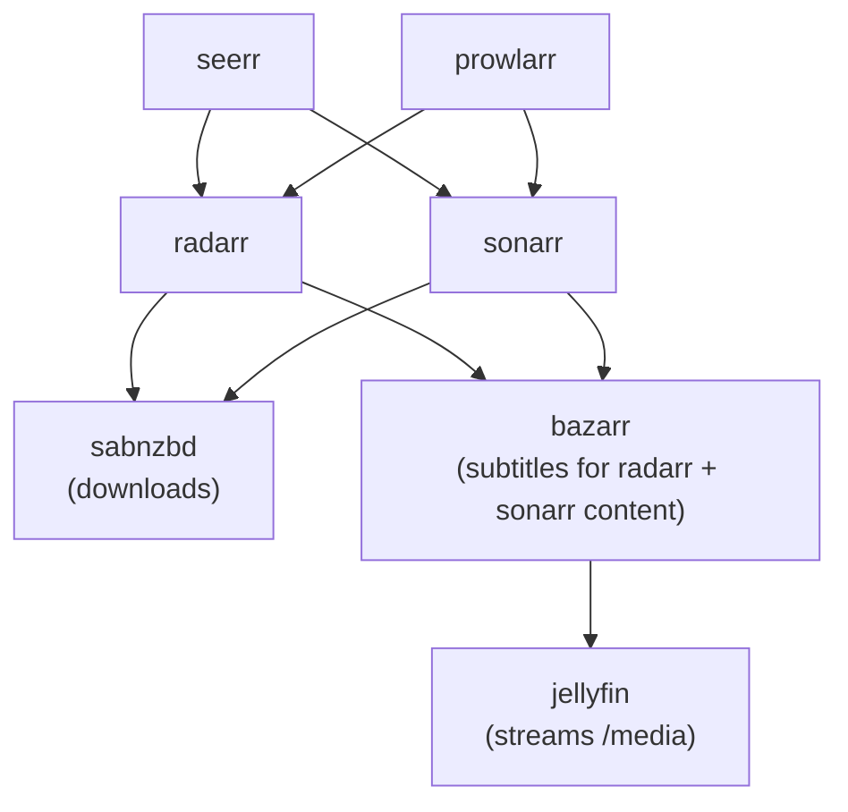

# Stack: medialab

Full media acquisition and streaming stack — from indexing and downloading to transcoding and playback.

## Services

| Service | Image | Port | Purpose |
|---------|-------|------|---------|
| `jellyfin` | `lscr.io/linuxserver/jellyfin:latest` | 8096 | Media server with hardware transcoding via Intel iGPU |
| `seerr` | `ghcr.io/seerr-team/seerr:latest` | 5055 | Media request manager (Overseerr fork) |
| `prowlarr` | `lscr.io/linuxserver/prowlarr:latest` | 9696 | Indexer aggregator for Radarr/Sonarr |
| `radarr` | `lscr.io/linuxserver/radarr:latest` | 7878 | Movie collection manager |
| `sonarr` | `lscr.io/linuxserver/sonarr:latest` | 8989 | TV series collection manager |
| `bazarr` | `lscr.io/linuxserver/bazarr:latest` | 6767 | Subtitle management |
| `sabnzbd` | `lscr.io/linuxserver/sabnzbd:latest` | 8080 | Usenet download client |

### Service Dependency Graph



### Direct-Port Access

Prowlarr, Radarr, Sonarr, Bazarr, and SABnzbd are accessible directly on host ports `10000–10004` (see table above) in addition to being on `public-net`. These ports fall within the `10000–10050` range reserved for internal/private services — see [README.md → Port Allocation](../../README.md#port-allocation). They have no built-in authentication and must never be exposed to the LAN or internet; access is currently restricted by convention only (host firewall / Tailscale-only binding is not yet enforced — tracked as a deferred item, see [README.md → Deferred Recommendations](../../README.md#deferred-recommendations)).

## Prerequisites

- `public-net` must exist: `docker network create public-net`
- Intel iGPU present for hardware transcoding (see `devices` in compose.yaml); remove the `devices` block and `group_add` if not available
- `PUID`/`PGID` should match the user that owns `PATH_MEDIA` and `PATH_STORAGE`

## Setup

```bash
cp stacks/.env.example stacks/medialab/.env
# Fill in the required variables (see below)
docker compose -f stacks/medialab/compose.yaml --env-file stacks/medialab/.env up -d
```

Or with the root Makefile:

```bash
make up STACK=medialab
```

## Configuration Variables

See [`.env.medialab.example`](.env.medialab.example) for a ready-to-copy template.

| Variable | Description | Example |
|----------|-------------|---------|
| `STACK_NAME` | Compose project name | `medialab` |
| `PATH_APPDATA` | App config directory | `/opt/appdata/medialab` |
| `PATH_STORAGE` | Downloads directory parent | `/mnt/storage-hdd/medialab` |
| `PATH_MEDIA` | Media library root | `/mnt/storage-hdd/media` |
| `PATH_LOGS` | Log directory | `/var/log/medialab` |
| `TZ` / `TIMEZONE` | Timezone | `Europe/Zurich` |
| `DOMAIN` | Primary domain | `example.com` |
| `PUID` | Host user ID for LinuxServer images | `1000` |
| `PGID` | Host group ID for LinuxServer images | `1000` |

## Exposed Ports

| Port | Service | Purpose |
|------|---------|---------|
| `10000` | Prowlarr | Indexer aggregator UI |
| `10001` | Radarr | Movie manager UI |
| `10002` | Sonarr | TV manager UI |
| `10003` | Bazarr | Subtitle manager UI |
| `10004` | SABnzbd | Usenet download client UI |
