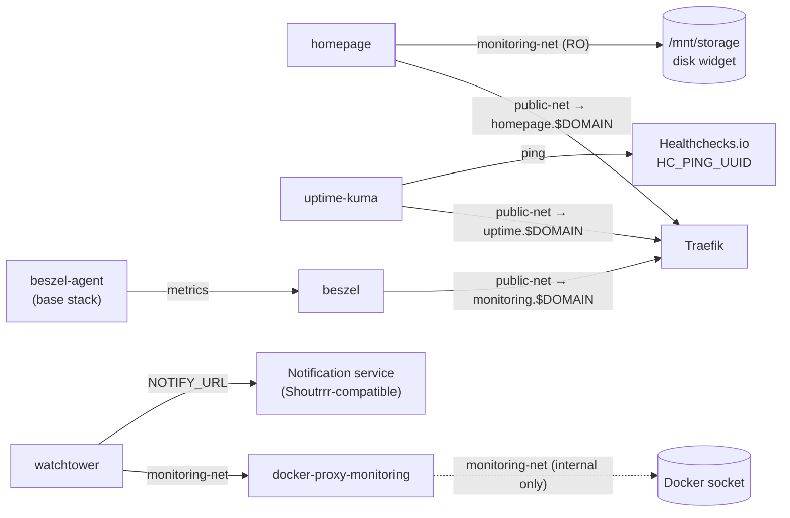

# Stack: monitoring

Observability, uptime tracking, dashboard, and automatic container updates.

## Services

| Service | Image | Purpose |
|---------|-------|---------|
| `homepage` | `ghcr.io/gethomepage/homepage:latest` | Customisable homelab dashboard |
| `uptime-kuma` | `louislam/uptime-kuma:2` | Service uptime monitoring with alerting |
| `beszel` | `henrygd/beszel:latest` | System resource monitoring hub (pairs with `beszel-agent` in the `base` stack) |
| `watchtower` | `nickfedor/watchtower:latest` | Automatically updates container images on a schedule (Saturdays 05:00) |
| `docker-proxy-monitoring` | `tecnativa/docker-socket-proxy` | Read-only Docker API proxy for safe container inspection by monitoring services |

### Interactions



## Prerequisites

- `public-net` must exist: `docker network create public-net`
- `NOTIFY_URL` must be a [Shoutrrr](https://containrrr.dev/shoutrrr/v0.8/services/overview/) compatible URL (e.g. Discord, Telegram, Gotify)
- `HC_PING_UUID` is a [Healthchecks.io](https://healthchecks.io) check UUID used as a dead-man's switch for Uptime Kuma
- Homepage configuration files must be placed in `PATH_APPDATA/homepage/`

## Setup

```bash
cp stacks/.env.example stacks/monitoring/.env
# Fill in the required variables (see below)
docker compose -f stacks/monitoring/compose.yaml --env-file stacks/monitoring/.env up -d
```

Or with the root Makefile:

```bash
make up STACK=monitoring
```

## Configuration Variables

See [`.env.monitoring.example`](.env.monitoring.example) for a ready-to-copy template.

| Variable | Description | Example |
|----------|-------------|---------|
| `STACK_NAME` | Compose project name | `monitoring` |
| `PATH_APPDATA` | App data directory | `/opt/appdata/monitoring` |
| `PATH_STORAGE` | Storage path mounted read-only by homepage | `/mnt/storage-hdd` |
| `PATH_LOGS` | Log directory | `/var/log/monitoring` |
| `TZ` | Timezone | `Europe/Zurich` |
| `DOMAIN` | Primary domain | `example.com` |
| `NOTIFY_URL` | Shoutrrr notification URL for Watchtower | *(secret — never commit)* |
| `HC_PING_UUID` | Healthchecks.io check UUID (dead-man's switch) | *(secret — never commit)* |

## Port Allocation

This stack has no direct host ports of its own — all services are exposed via Traefik on `public-net`. See [README.md → Port Allocation](../../README.md#port-allocation) for the homelab-wide `10000–10050` range reserved for internal/private services (used by the `medialab` stack).
