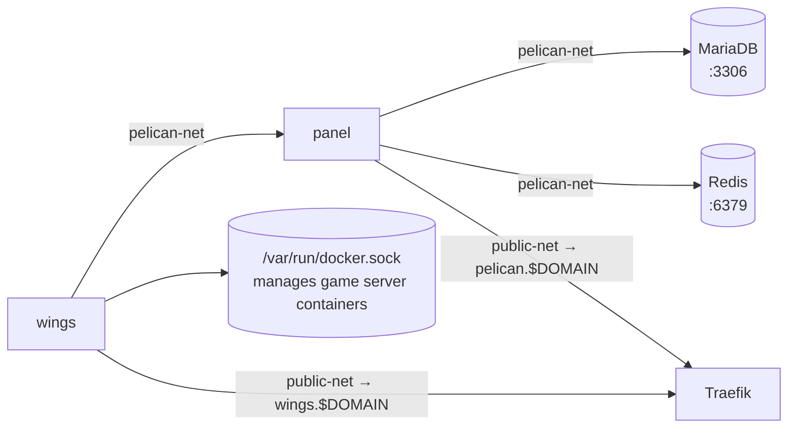

# Stack: pelican

Game server management panel powered by [Pelican](https://pelican.dev) (a Pterodactyl fork).

## Services

| Service | Image | Purpose |
|---------|-------|---------|
| `panel` | `ghcr.io/pelican-dev/panel:latest` | Web UI for managing game servers |
| `database` | `mariadb:11` | Persistent storage for panel data |
| `redis` | `redis:7-alpine` | Session cache and queue backend for the panel |
| `wings` | `ghcr.io/pelican-dev/wings:latest` | Daemon that runs and manages the actual game server containers |

### Interactions



Wings requires access to `/var/run/docker.sock`, `/var/lib/docker/volumes`, and `/etc/pelican` on the host. The Wings configuration file is generated by the panel during the node setup wizard.

## Prerequisites

- `public-net` must exist: `docker network create public-net`
- Wings configuration at `/etc/pelican/config.yml` (created via the panel node setup wizard on first run)
- Strong, unique passwords for `PELICAN_DB_ROOT_PASSWORD` and `PELICAN_DB_PASSWORD`

## Setup

```bash
cp stacks/.env.example stacks/pelican/.env
# Fill in the required variables (see below)
docker compose -f stacks/pelican/compose.yaml --env-file stacks/pelican/.env up -d
```

Or with the root Makefile:

```bash
make up STACK=pelican
```

Then visit `https://pelican.<domain>` and complete the panel installation wizard. During the wizard you will configure the Wings node, which writes `/etc/pelican/config.yml`.

## Configuration Variables

See [`.env.pelican.example`](.env.pelican.example) for a ready-to-copy template.

| Variable | Description | Example |
|----------|-------------|---------|
| `STACK_NAME` | Compose project name | `pelican` |
| `PATH_APPDATA` | App data directory | `/opt/appdata/pelican` |
| `TZ` | Timezone | `Europe/Zurich` |
| `DOMAIN` | Primary domain | `example.com` |
| `PELICAN_DB_ROOT_PASSWORD` | MariaDB root password | *(secret — never commit)* |
| `PELICAN_DB_PASSWORD` | MariaDB pelican user password | *(secret — never commit)* |
